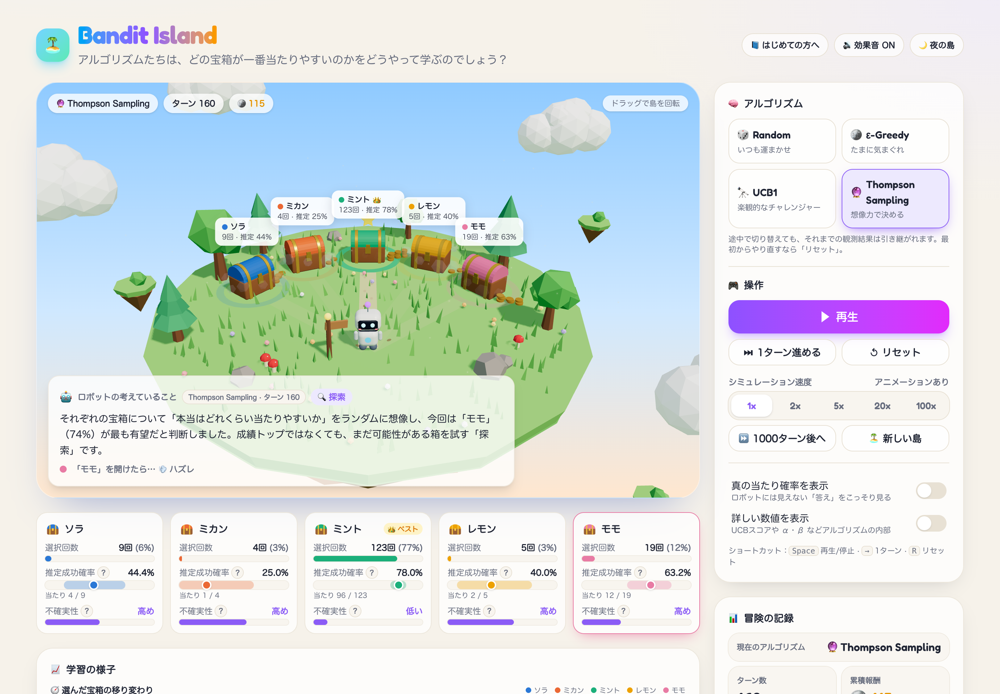
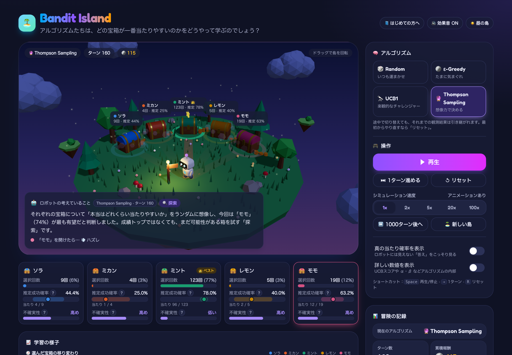

# 🏝️ Bandit Island

[](https://github.com/yasut0ra/bandit-island/actions/workflows/ci.yml)
[](LICENSE)

**「探索と活用って、こういうことか！」が目で見て分かる、マルチアームド・バンディットの 3D 学習アプリ。**



小さな浮島に 5 つの宝箱があります。それぞれの宝箱には、ロボットには見えない「当たり確率」が隠されています。
ロボットは毎ターン 1 つの宝箱を選んで開け、当たりならコインや宝石を手に入れます。
試行を繰り返すうちに、ロボットは「どの宝箱が一番当たりやすいのか？」を少しずつ学んでいきます。

- 最初はいろいろな箱を試す **探索（Exploration）**
- 良さそうな箱に集中する **活用（Exploitation）**

このトレードオフを、霧・足跡・コインの山・グラフで直感的に体験できます。

<details>
<summary>🌙 夜の島（ダークモード）</summary>



</details>

## 起動方法

Node.js 20.9 以上（推奨 22）が必要です。

```bash
git clone https://github.com/yasut0ra/bandit-island.git
cd bandit-island
npm install
npm run dev
```

ブラウザで http://localhost:3000 を開いてください。

| コマンド | 内容 |
| --- | --- |
| `npm run dev` | 開発サーバーを起動 |
| `npm run build` / `npm start` | 本番ビルド / 本番サーバー起動 |
| `npm run typecheck` | TypeScript の型チェック |
| `npm run test:bandits` | アルゴリズムの検証スクリプト（Beta 分布サンプラーの統計量、UCB1 の式、各手法が Random より後悔が小さいこと等） |

## 使用技術

- [Next.js](https://nextjs.org/)（App Router）+ TypeScript
- [Tailwind CSS](https://tailwindcss.com/) v4
- [react-three-fiber](https://r3f.docs.pmnd.rs/) + [@react-three/drei](https://github.com/pmndrs/drei)（3D シーン）
- Web Audio API（効果音。音声ファイルは使っていません）

外部 API・データベース・認証は使わず、すべてブラウザ内で完結します。3D モデルもすべて基本図形の組み合わせです。

## 遊び方と画面の見かた

| 見えるもの | 意味 |
| --- | --- |
| 🌫️ 宝箱のまわりの紫の霧 | 不確実性。まだあまり試していない箱ほど濃く、試すほど晴れる |
| 👣 道と足跡 | よく選ばれている箱ほど道がくっきりし、足跡が増える |
| 🪙 コインの山 | その箱で当たった回数（対数スケールで積み上がる） |
| ⭐ 回る星 / 👑 | 現在もっとも良いと推定している箱 |
| 💡 ロボットのアンテナ | 紫 = 探索中、オレンジ = 活用中 |
| 🤖 考えていること | 毎ターン、アルゴリズムがその箱を選んだ理由を日本語で表示 |
| 🧭 選んだ宝箱の移り変わり | 左（序盤）は色が混ざり、右（最近）は 1 色に近づくほど学習が進んでいる |

主な操作：アルゴリズム選択 / 再生・一時停止 / 1 ターン進める / リセット / 速度（1x〜100x）/ 1000 ターン後へ /
新しい島（当たり確率を入れ替え）/ 真の当たり確率の表示 / 詳しい数値（UCB スコア、α・β など）の表示 / 効果音 / 昼夜（ダークモード）。
キーボード：`Space` 再生/停止、`→` 1 ターン、`R` リセット。

**途中でアルゴリズムを変えた場合**、それまでの観測（各箱の選択回数・当たり回数）は引き継がれ、新しいアルゴリズムがそこから判断を続けます。
グラフには切り替え地点が点線で表示されます。最初からやり直す場合は「リセット」を押してください。

**アルゴリズム対決（Compare Mode）** では、今の島で 2 つのアルゴリズムを 100 回ずつ裏で走らせ、平均の累積後悔を比較できます。

## 実装しているアルゴリズム

報酬モデルはベルヌーイ分布（当たり = 1 / ハズレ = 0）です。初期の真の当たり確率は `[0.45, 0.15, 0.75, 0.30, 0.60]`（「新しい島」で並びが入れ替わります）。

### 🎲 Random
毎回ランダムに箱を選びます。過去の結果を一切使わない、比較用のベースラインです。

### 🪙 ε-Greedy
確率 ε でランダムに箱を選び（探索）、それ以外は観測平均が最大の箱を選びます（活用）。同点はランダムに決めます。
ε は画面のスライダーで 0〜0.5 の範囲で変更できます（初期値 0.1）。

### 🔭 UCB1
まず全ての箱を 1 回ずつ試し、その後は次のスコアが最大の箱を選びます。

```
score_i = 平均報酬_i + √(2 · ln t / n_i)     （t: 総試行回数, n_i: 箱 i の試行回数）
```

第 2 項が「探索ボーナス（exploration bonus）」で、あまり試していない箱ほど大きくなります。「分からないものは楽観的に期待する」戦略です。

### 🔮 Thompson Sampling
各箱の当たり確率について、一様事前分布からの事後分布 `Beta(1 + 当たり回数, 1 + ハズレ回数)` を持ちます。
毎ターン各箱の分布から値を 1 つサンプリングし、最大の箱を選びます。自信のない箱ほど分布の幅が広く、ときどき高い値が出るため、自然に探索が起こります。
Beta 分布のサンプリングはガンマ分布（Marsaglia–Tsang 法）から自前で実装しています。

### 探索 / 活用の判定
画面のバッジは次のルールで表示しています。

- Random：常に「探索」
- ε-Greedy：ε のサイコロで探索したら「探索」、そうでなければ「活用」
- UCB1 / Thompson Sampling：選んだ箱が「現時点の推定値（UCB1 は観測平均、TS は事後平均）が最大の箱」なら「活用」、それ以外（ボーナスや想像で選ばれた箱）なら「探索」

### 統計量
- **累積報酬**：当たりの合計回数
- **累積後悔（Cumulative Regret）**：期待後悔 `Σ (p* − p_選んだ箱)`。最初から最良の箱を選び続けた場合との差
- **不確実性**：`Beta(1+s, 1+f)` の標準偏差を、何も知らない状態（Beta(1,1)）を 1 として正規化した値
- **推定成功確率の帯**：おおよその 95% 信用区間

## ディレクトリ構成

```
app/                     Next.js のページとグローバルスタイル
components/
  BanditIslandApp.tsx    画面全体の組み立て
  scene/                 3D シーン（島・宝箱・ロボット・演出・環境）
  panels/                操作・統計・宝箱カード・グラフ・解説・Compare Mode
hooks/
  useBanditSimulation.ts シミュレーションの状態管理と再生ループ
lib/
  bandits/               ★ UI から独立したバンディットのロジック
    random.ts / epsilonGreedy.ts / ucb.ts / thompsonSampling.ts
    simulation.ts        ベルヌーイ環境・履歴・後悔の計算
    experiment.ts        Compare Mode 用のモンテカルロ実験
    rng.ts / stats.ts    シード付き乱数・Beta サンプラー・統計ヘルパー
  explain.ts             アルゴリズムの説明文と「選んだ理由」の日本語生成
scripts/verify-bandits.ts アルゴリズムの検証スクリプト
```

乱数はシード付き（mulberry32）で状態をリデューサーに保持しているため、シミュレーションは純粋関数として再現可能です。

## ライセンス

[MIT](LICENSE)
